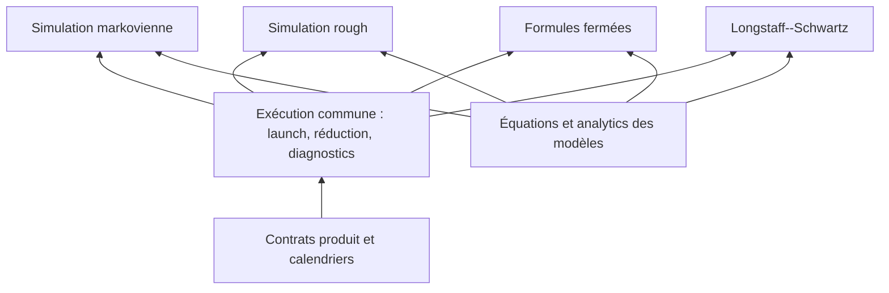
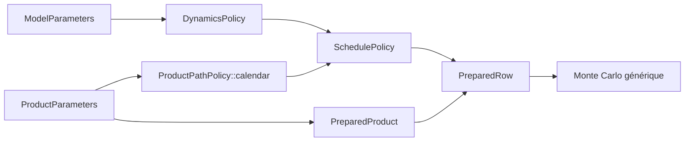
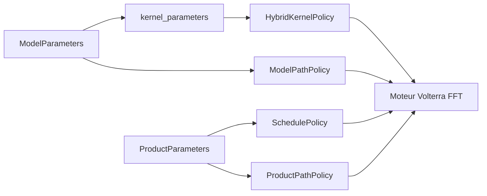

# Composition des politiques de pricing CUDA

Cette page explique où se fait la factorisation entre modèles, moteurs et
produits. Elle montre les flux et les frontières de responsabilité ; les
signatures et invariants normatifs restent dans les contrats
[dynamics](model-dynamics-contract.md),
[pricing](closed-form-and-monte-carlo-pricing-contract.md),
[analytics](model-analytics-contract.md) et
[early exercise](american-and-bermudan-pricing-contract.md).

Le
[`capability_manifest.py`](../../tools/codegen/pricing_bindings/capability_manifest.py)
est l'unique inventaire des combinaisons actives. Cette page ne doit pas
devenir une seconde matrice modèle-produit.

## Lire la pyramide



La factorisation monte du spécifique vers le commun :

1. une policy modèle possède les équations et la préparation numérique ;
2. une policy de schedule traduit le calendrier produit en transitions ;
3. une policy produit possède observations, état path-dependent et payoff ;
4. une policy de pricing assemble une ligne préparée ;
5. un moteur générique possède kernels, workspace, réduction et diagnostics.

Une composition modèle-produit sous `src/model/.../<model>/product/` ne doit
être qu'une façade mince vers ces briques. Le codegen génère les façades
répétitives à partir du manifeste.

## Vocabulaire commun

| Objet | Propriétaire | Ne connaît pas |
|---|---|---|
| `ModelParameters` | modèle | produit, calendrier, moteur |
| `ProductParameters` | produit | dynamique, kernel |
| `DynamicsPolicy` ou `ModelPathPolicy` | modèle | payoff |
| `SchedulePolicy` | moteur de simulation | sens financier des observations |
| `ProductPathPolicy` | produit | méthode de simulation |
| `PreparedRow` | policy de pricing | sortie ou format de dataset |
| `DeviceInputs` | composition | équations internes du modèle |
| launcher et kernel | moteur générique | identité métier du couple modèle-produit |

La préparation est effectuée une fois par ligne chaque fois que sa taille et
son coût le permettent. L'état et le handler mutables sont path-local. Les
choix de modèles, de produits, de côtés call/put et de nombres de facteurs sont
résolus à la compilation ; aucun dispatch indirect n'est ajouté dans une
boucle chaude.

## 1. Factorisation markovienne

### 1.1 Transition exacte

Une dynamique exacte sépare les invariants du modèle de ceux d'un intervalle :

```text
ModelParameters -> prepare_model -> PreparedModel
(PreparedModel, delta_t) -> prepare_transition -> PreparedTransition
(PreparedModel, PreparedTransition, random, state) -> simulate_one_step
```

Le schedule crée uniquement les transitions correspondant aux intervalles
contractuels. Une option terminale utilise donc une transition de `0` à `T`,
sans sous-pas artificiels. Les calendriers réguliers ou irréguliers réutilisent
le même contrat en préparant les durées distinctes nécessaires.

### 1.2 Schéma à pas fixe

Une dynamique discrétisée prépare ses coefficients pour le `dt` global :

```text
(ModelParameters, dt) -> prepare_dynamics -> PreparedDynamics
(PreparedDynamics, step_count, random, state) -> advance
```

Le produit fournit des jours contractuels entiers. Le schedule les convertit
en nombres de pas et possède la boucle temporelle ; la dynamique ne sait pas
pourquoi un intervalle est observé. Les variantes terminale, dense, régulière,
avec stub ou calendrier statique diffèrent par leur schedule, pas par une
copie du moteur Monte Carlo.

### 1.3 Socle markovien général

Les transitions exactes et à pas fixe convergent vers la même composition :



`ProductPathPolicy` possède le calendrier, la préparation du produit, le
handler d'observation et la finalisation du payoff. Le même handler sert avec
un schedule compatible sans connaître la dynamique. Le produit reste donc la
source unique du calendrier contractuel.

Le kernel générique `monte_carlo_price_kernel<PricingPolicy>` :

1. charge et prépare une ligne modèle-produit ;
2. partage ses invariants dans le bloc ;
3. distribue les chemins avec le mapping Philox contractuel ;
4. appelle `PricingPolicy::evaluate_path` ;
5. réduit les moments en FP64 ;
6. écrit prix et erreur standard.

L'identifiant de manifeste `equity_markovian` sélectionne cette famille. Les
signatures complètes, budgets de stockage et conventions temporelles sont dans
le [contrat de pricing](closed-form-and-monte-carlo-pricing-contract.md).

`fixed_income_monte_carlo` réutilise exactement ce kernel pour les swaptions
européennes gaussiennes à deux facteurs. Le schedule simule conjointement les
facteurs terminaux et leur intégrale ; la policy produit évalue le swap avec
les ZCB conditionnels, puis actualise son payoff. La composition ajustée ajoute
la courbe aux analytics, sans moteur MC parallèle ni grille temporelle fine.

## 2. Factorisation rough

### 2.1 Volterra gaussien par FFT

Le moteur `equity_volterra_fft` sépare quatre responsabilités :

| Policy | Responsabilité |
|---|---|
| `HybridKernelPolicy` | Préparer le noyau, ses poids, sa variance et reconstruire la valeur Volterra |
| `ModelPathPolicy` | Transformer la valeur Volterra en état propre au modèle |
| `SchedulePolicy` | Mapper les dates produit sur la grille FFT |
| `ProductPathPolicy` | Observer le chemin et calculer le payoff |

Ici, `KernelPolicy` désigne le noyau mathématique de convolution, pas une
fonction CUDA `__global__`.



Le moteur prépare une fois par ligne le spectre du noyau et les variances
déterministes requises. Il calcule la convolution lointaine en
$`O(N\log N)`$, reconstruit la cellule singulière, puis appelle
`ModelPathPolicy::advance`. L'évolution de l'état reste séquentielle en
$`O(N)`$ par chemin. Le moteur ne dépend d'aucun champ interne de
`PreparedKernel` et ne matérialise pas les trajectoires complètes de spot ou de
volatilité en VRAM.

Le contrat `HybridPathPolicyFor` vérifie notamment que
`kernel_parameters()` retourne exactement `KernelPolicy::Parameters`.

### 2.2 Approximation markovienne N-facteurs

Le moteur `equity_n_factor` ajuste le noyau rough par une somme exponentielle.
La préparation coûteuse des nœuds, poids et coefficients récurrents se fait
sur l'hôte, une fois par ligne. Le nombre de facteurs est un paramètre de
template ; le device reçoit un `PreparedDynamics<FactorCount>` compact.

```text
ModelParameters -> fit N-facteurs sur l'hôte -> PreparedDynamics<N>
PreparedDynamics<N> + ProductPathPolicy -> moteur Monte Carlo markovien commun
```

Le lift ne possède donc ni second payoff, ni second schedule, ni second kernel
de réduction. Une modification du fit doit requalifier convergence en temps et
en facteurs, mapping Philox, registres, spills et coût end-to-end.

### 2.3 Socle rough général

FFT et N-facteurs factorisent ce qui est mathématiquement commun, sans masquer
leurs différences d'exécution :

- les paramètres rough et la transformation modèle restent dans le modèle ;
- calendrier, handler et payoff restent dans `ProductPathPolicy` ;
- FFT possède convolution et workspace fréquentiel ;
- N-facteurs possède le fit hôte puis réutilise le moteur markovien ;
- les deux exposent les mêmes coordonnées observables au produit ;
- aucun réglage de chunk, de bloc ou de nombre de facteurs n'est présenté comme
  universel sans mesure par architecture.

## 3. Factorisation rough–markovienne

La frontière partagée n'est pas une super-dynamique artificielle. Elle est
constituée des contrats qui ne dépendent pas de la mémoire du processus :

- `ProductPathPolicy` et son handler ;
- extraction du calendrier depuis `ProductParameters` ;
- contexte de préparation du produit ;
- conventions d'observation spot/log-spot ;
- mapping déterministe ligne-chemin vers Philox ;
- accumulation FP64 des moments, résultat et erreur standard ;
- validations de lancement et diagnostics de ressources.

Ainsi, ajouter un produit compatible ne doit pas créer une implémentation par
moteur. Ajouter un moteur ne doit pas recopier les produits. Seuls les adapters
de composition et les préparations réellement différentes restent spécifiques.

## 4. Formules fermées equity–fixed income

Les engines `equity_closed_form` et `fixed_income_closed_form` partagent le
même contrat d'exécution :

```cpp
using DeviceInputs;
using TimeConfiguration;
using PreparedRow;

static PreparedRow prepare_row(...);
static float evaluate_price(const PreparedRow& row);
```

`closed_form::launch_closed_form_cuda` valide les dimensions, prépare une ligne
par thread et sélectionne statiquement le kernel direct ou grid-stride. Il n'y
a ni Philox, ni état de chemin, ni réduction Monte Carlo.

La factorisation s'arrête à la frontière mathématique :

- Black--Scholes combine les analytics lognormales et le contrat produit ;
- les modèles de taux autonomes fournissent leurs analytics affines ;
- les modèles ajustés à une courbe composent un provider de courbe sans
  l'intégrer aux paramètres du modèle ;
- les familles un facteur, deux facteurs, CIR et gaussiennes restent des
  spécialisations explicites lorsque leurs formules diffèrent ;
- les schedules variables restent des vues produit, pas une dépendance des
  analytics modèle.

Les formules et tolérances appartiennent au contrat de pricing et aux
références mathématiques locales ; les templates de codegen ne doivent contenir
que la façade répétitive.

## 5. Factorisation fixed income–equity

Les deux domaines partagent les mécanismes d'exécution qui ont le même contrat,
pas leurs états financiers :

| Niveau partagé | Spécialisation conservée |
|---|---|
| Launcher closed form | Analytics et `PreparedRow` propres au domaine |
| Kernel Monte Carlo et réduction | Dynamics, schedule et payoff |
| Longstaff--Schwartz | État de régression, actualisation et valeur immédiate |
| Diagnostics et guards | Géométrie et budgets propres au kernel spécialisé |
| Codegen des façades | Métadonnées de composition du manifeste |

Pour l'early exercise, les engines `equity_lsm_fixed`, `equity_lsm_exact` et
`fixed_income_lsm` partagent workspace, induction backward, régression,
Cholesky et diagnostics. La policy domaine fournit les dates d'exercice,
l'état de régression, la valeur immédiate et l'actualisation. Une transition
jointe exacte n'est déclarée que lorsqu'elle existe réellement ; une
discrétisation fixed-step ne peut pas être renommée « exacte » pour homogénéiser
la surface.

## 6. Sampling modèle

Le sampling ne compose aucun produit. Une source de paramètres, une source de
calendriers et une policy d'observation construisent les trajectoires du modèle.
Il réutilise les mêmes dynamiques et préparations que le pricing :

| Engine du manifeste | Réutilisation |
|---|---|
| `sample_markovian` | Dynamics exactes ou fixed-step |
| `sample_n_factor` | Fit hôte et `PreparedDynamics<N>` |
| `sample_volterra_fft` | `HybridKernelPolicy`, `ModelPathPolicy` et moteur FFT |
| `sample_fixed_income` | Dynamics et observations de taux |

Les bindings `sample.cuh/.cu`, helpers et recettes sont dérivés du manifeste.
Le contrat des formes publiées, grilles et limites mémoire est
[`model-sample-dataset-generation.md`](../model-sample-dataset-generation.md).

## Règles d'extension

Avant d'ajouter une implémentation, déterminer dans cet ordre :

1. l'équation appartient-elle au modèle ou à une primitive commune ?
2. le calendrier et le payoff existent-ils déjà comme contrat produit ?
3. la simulation est-elle exacte, fixed-step, N-facteurs ou Volterra FFT ?
4. la composition satisfait-elle un engine existant du manifeste ?
5. le code demandé est-il une façade générable ou une vraie spécialisation ?
6. la différence modifie-t-elle le contrat numérique, les ressources ou le
   mapping Philox ?

Une nouvelle copie de boucle, de payoff, de réduction, de launcher ou de
binding est un signal de factorisation manquante. Une abstraction commune qui
ajoute une branche runtime dans un kernel chaud, augmente les ressources sans
mesure ou confond deux schémas numériques est également incorrecte.
