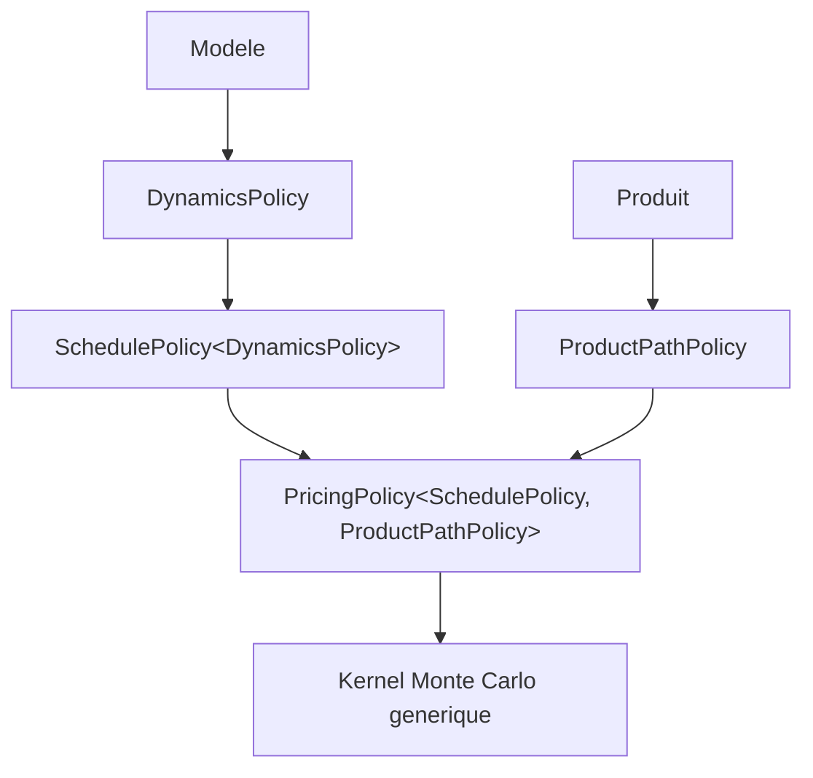
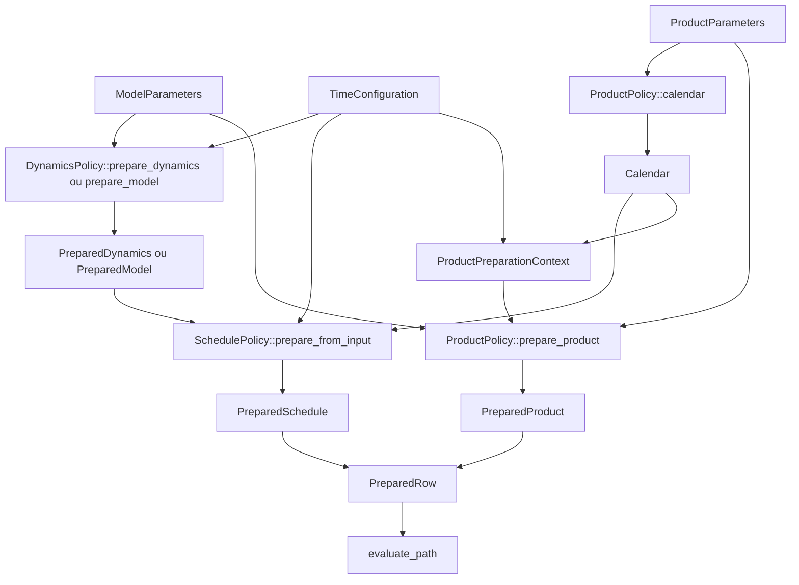
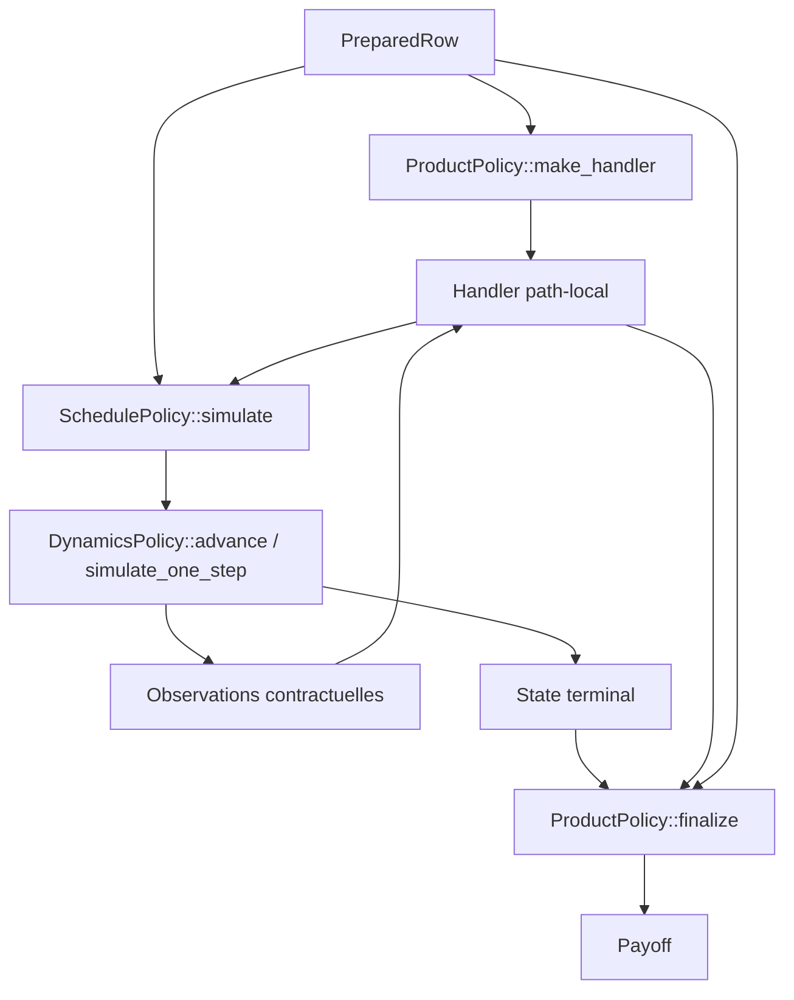
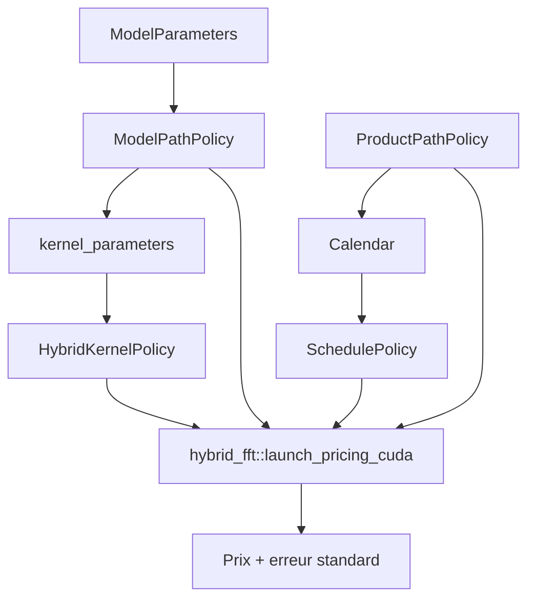
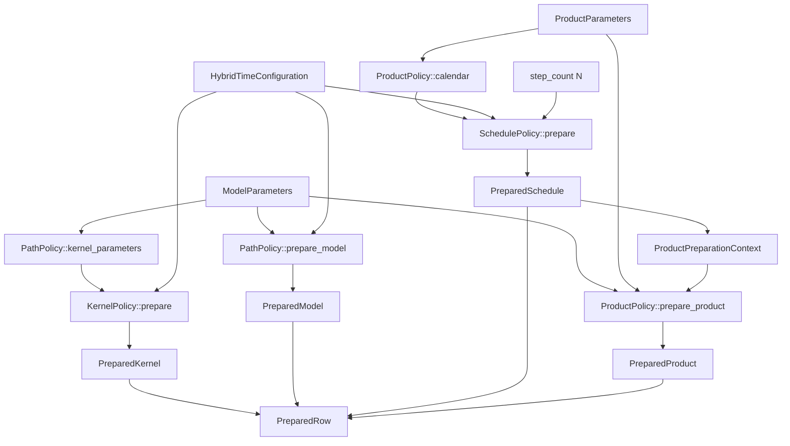
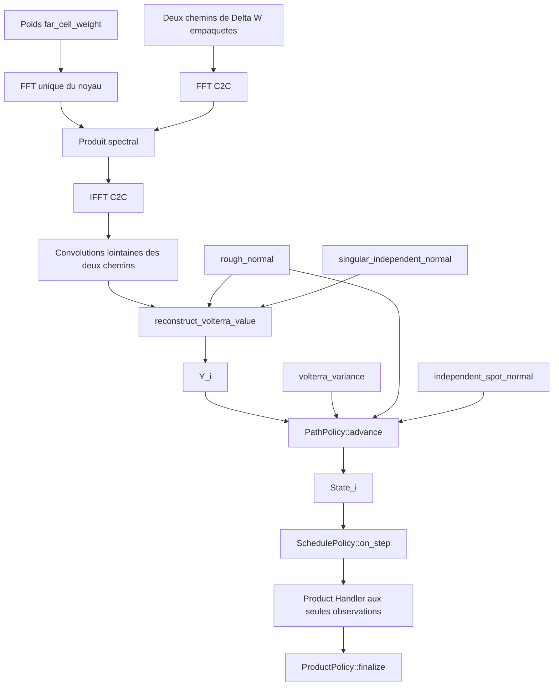

# Composition des politiques de pricing CUDA

## Objet

Ce document explique comment les objets de simulation et de pricing sont
composes. Il complete les contrats normatifs de dynamique et de pricing sans
les remplacer. Il privilegie les flux de donnees et le cycle de vie des objets
afin de rendre visible l'origine de chaque information.

La premiere section couvre le Monte Carlo markovien. La seconde couvre les
modeles a noyau Volterra gaussien simules par schema hybride et FFT. Les
sections closed form et rough par approximation markovienne N-facteurs seront
ajoutees apres validation de leurs schemas respectifs.

## 1. Monte Carlo markovien

### 1.1 Vue generale

La composition possede deux niveaux distincts :

- les types de politiques sont assembles a la compilation ;
- leurs objets prepares sont construits pour une ligne de prix au runtime.

Les policies sont des structures statiques sans donnee membre, sans heritage,
sans fonction virtuelle et sans dispatch runtime dans le kernel.

#### Composition des types



Un exemple de composition est :

```cpp
using Dynamics = heston::DynamicsPolicy;
using Schedule = simulation::FixedStepDenseSchedule<Dynamics>;
using Product = product::AsianOptionPathPolicy<OptionSide::call>;
using Pricing = equity::PathProductMonteCarloPricingPolicy<
    Schedule,
    Product
>;
```

#### Construction runtime d'une ligne de prix



Le calendrier du `PreparedSchedule` vient donc toujours du produit :

```text
ProductParameters
    -> ProductPolicy::calendar(ProductParameters)
    -> Calendar
    -> SchedulePolicy
    -> PreparedSchedule
```

### 1.2 `DynamicsPolicy` : equations et transitions du modele

`DynamicsPolicy` interprete les `ModelParameters`. Elle encode uniquement le
processus stochastique, son etat et sa consommation aleatoire. Elle ne connait
ni produit, ni calendrier, ni payoff.

Le socle commun expose :

```cpp
using Parameters;
using RandomContext;
using State;
```

| Element | Responsabilite |
|---|---|
| `Parameters` | Ligne brute du modele. |
| `RandomContext` | Suite Philox et caches path-local requis par la dynamique. |
| `State` | Variables mutables d'un chemin, conservees en registres si possible. |

Une dynamique equity ajoute `spot(state)` et, lorsqu'elle le peut,
`log_spot(state)`. Ces observables sont des capacites de marche separees du
contrat stochastique minimal.

#### Schema numerique a pas fixe

Une dynamique preparee pour un pas homogene expose :

```cpp
using PreparedDynamics;

static constexpr bool kPartitionInvariantAdvance;

static PreparedDynamics prepare_dynamics(
    const Parameters& parameters,
    float dt
);

static State initial_state(
    const PreparedDynamics& dynamics
);

static void advance(
    const PreparedDynamics& dynamics,
    std::uint32_t step_count,
    RandomContext& random,
    State& state
);
```

`PreparedDynamics` contient les coefficients invariants pour les transitions
de taille `dt` : exponentielles, coefficients de drift et de diffusion,
coefficients QE-M, correlations ou autres quantites propres au schema.

`advance(dynamics, n, random, state)` avance un intervalle non observe de `n`
pas homogenes. Le schedule decide la valeur de `n`; la dynamique ne connait
pas la raison contractuelle de cet intervalle.

La methode `prepare_dynamics` n'est requise sur le device que lorsque la
preparation y est suffisamment legere. Une dynamique couteuse preparee sur
l'hote peut fournir directement `PreparedDynamics` au schedule.

#### Transition exacte

Un modele a transition exacte separe les invariants du modele et ceux d'un
intervalle :

```cpp
using PreparedModel;
using PreparedTransition;

static PreparedModel prepare_model(
    const Parameters& parameters
);

static PreparedTransition prepare_transition(
    const PreparedModel& model,
    float delta_t
);

static State initial_state(
    const PreparedModel& model
);

static void simulate_one_step(
    const PreparedModel& model,
    const PreparedTransition& transition,
    RandomContext& random,
    State& state
);
```

`PreparedModel` est invariant par rapport au temps. Le schedule construit un
`PreparedTransition` pour chaque duree contractuelle distincte dont il a
besoin. Une option terminale peut ainsi etre simulee par une transition exacte
de `0` a `T`, sans introduire de sous-pas artificiels.

### 1.3 `SchedulePolicy` : traduction du calendrier en transitions

Le schedule est specialise statiquement sur une dynamique :

```cpp
SchedulePolicy<DynamicsPolicy>
```

Il expose :

```cpp
using Dynamics;
using Calendar;
using TimeConfiguration;
using PreparedSchedule;
```

| Element | Responsabilite |
|---|---|
| `Dynamics` | Policy utilisee pour preparer et faire avancer l'etat. |
| `Calendar` | Dates contractuelles, exprimees en jours entiers. |
| `TimeConfiguration` | Convention transformant les jours en temps numerique. |
| `PreparedSchedule` | Dynamique preparee, transitions et indices d'observation compacts. |

Les calendriers communs sont :

```cpp
MaturityCalendar { maturity_days };

RegularCalendar {
    observation_interval_days,
    observation_count
};

StubbedRegularCalendar {
    first_observation_day,
    observation_interval_days,
    observation_count
};

StaticCalendar<N> { interval_days[N] };
```

Pour un schema fixe :

```cpp
FixedStepTimeConfiguration {
    float dt;
    std::uint32_t simulation_steps_per_day;
};
```

Pour une transition exacte, la configuration ne porte que la convention de
fraction d'annee requise pour convertir les jours contractuels.

#### Preparation explicite

La decomposition conceptuelle complete est :

```cpp
const PreparedDynamics dynamics = Dynamics::prepare_dynamics(
    model_parameters,
    time_configuration.dt
);

const Calendar calendar = ProductPolicy::calendar(product_parameters);

const PreparedSchedule schedule = Schedule::prepare_from_dynamics(
    dynamics,
    calendar,
    time_configuration
);
```

La methode de commodite :

```cpp
Schedule::prepare(model_parameters, calendar, time_configuration)
```

effectue ces operations interieurement. Elle ne change pas la frontiere de
responsabilite : les equations restent dans `DynamicsPolicy`, le calendrier
reste fourni par le produit et le schedule ne fait que les composer.

#### Capacites de simulation

Un produit terminal demande :

```cpp
State Schedule::simulate_terminal(
    const PreparedSchedule& schedule,
    philox::PhiloxKey key,
    std::size_t path
);
```

Un produit de chemin demande :

```cpp
State Schedule::simulate(
    const PreparedSchedule& schedule,
    philox::PhiloxKey key,
    std::size_t path,
    Handler& handler
);
```

Le schedule possede la boucle temporelle et appelle le handler uniquement aux
dates contractuelles. Il ignore ce que l'observation signifie pour le produit.

Les principales compositions sont :

| Besoin | Pas fixe | Transition exacte |
|---|---|---|
| Etat terminal | `FixedStepTerminalSchedule` | `ExactTransitionTerminalSchedule` |
| Observations regulieres | `FixedStepRegularSchedule` | `ExactTransitionRegularSchedule` |
| Observation de chaque pas | `FixedStepDenseSchedule` | grille exacte reguliere si requise |
| Calendrier statique | `FixedStepCalendarSchedule<N>` | `ExactTransitionCalendarSchedule<N>` |

### 1.4 `ProductPathPolicy` : contrat et payoff

Le produit fournit le calendrier contractuel et la logique de payoff sans
dependre du moteur de simulation. Le contrat partageable expose :

```cpp
using ProductParameters;
using Calendar;
using PreparedProduct;
using Handler;

static constexpr equity::ObservationCoordinate kObservationCoordinate;

static Calendar calendar(
    const ProductParameters& parameters
);

static PreparedProduct prepare_product(
    const ModelParameters& model,
    const ProductParameters& product,
    equity::ProductPreparationContext context
);

static Handler make_handler(
    const PreparedProduct& product
);

template<typename StatePolicy>
static float finalize(
    const PreparedProduct& product,
    const StatePolicy::State& terminal,
    const Handler& handler
);
```

#### `ProductParameters`

Il s'agit de la ligne brute du contrat : maturite, strike, barriere, intervalles
d'observation, coupons ou autres termes contractuels.

#### `Calendar`

`ProductPolicy::calendar(product_parameters)` extrait uniquement la structure
temporelle du contrat. Cette valeur est transmise au schedule et sert aussi a
construire le contexte temporel du produit.

#### `PreparedProduct`

Il contient les quantites invariantes entre tous les chemins d'un prix :
strike, discount, niveaux de barriere ou coefficients de payoff. Il ne contient
normalement pas le handler mutable.

#### `Handler`

Le handler est construit separement pour chaque trajectoire :

```cpp
Handler handler = ProductPolicy::make_handler(prepared_product);
```

Il recoit les observations et conserve l'etat path-dependent : somme pour une
asiatique, minimum ou maximum pour un lookback, etat de barriere, coupons ou
etat d'autocall. Retourner `false` depuis une observation autorise l'arret
immediat du chemin.

Le contrat produit commun travaille sur une coordonnee scalaire : spot ou
log-spot. `PathProductObservationAdapter` extrait cette coordonnee depuis
l'etat du modele avant d'appeler :

```cpp
bool Handler::on_initial_value(float value);

bool Handler::on_observation(
    std::uint32_t observation,
    float value
);
```

### 1.5 `PricingPolicy` : assemblage de la ligne et evaluation

La pricing policy est la colle entre le schedule et le produit. Le kernel
Monte Carlo scalaire lui impose :

```cpp
using Schedule;
using DeviceInputs;
using ProductParameters;
using PreparedRow;

static PreparedRow prepare_row(...);

static float evaluate_path(
    const PreparedRow& row,
    philox::PhiloxKey key,
    std::size_t path
);
```

Pour le contrat produit partageable :

```cpp
struct PreparedRow {
    typename Schedule::PreparedSchedule schedule;
    typename ProductPolicy::PreparedProduct product;
};
```

La preparation d'une ligne rend explicite l'origine du calendrier :

```cpp
static PreparedRow prepare_row(
    const ModelParameters& model,
    const ProductParameters& product_parameters,
    const TimeConfiguration& time_configuration
) {
    const typename ProductPolicy::Calendar calendar =
        ProductPolicy::calendar(product_parameters);

    return {
        Schedule::prepare(model, calendar, time_configuration),
        ProductPolicy::prepare_product(
            model,
            product_parameters,
            preparation_context(calendar, time_configuration)
        ),
    };
}
```

`Schedule::prepare` est ici la forme compacte de la preparation en deux etapes
`Dynamics::prepare_*` puis `Schedule::prepare_from_input` decrite plus haut.

L'evaluation d'un chemin est :



Sous forme de code :

```cpp
static float evaluate_path(
    const PreparedRow& row,
    philox::PhiloxKey key,
    std::size_t path
) {
    auto handler = ProductPolicy::make_handler(row.product);

    const State terminal = Schedule::simulate(
        row.schedule,
        key,
        path,
        handler
    );

    return ProductPolicy::finalize(
        row.product,
        terminal,
        handler
    );
}
```

Un terminal schedule remplace `simulate(..., handler)` par
`simulate_terminal(...)`; la finalisation reste propriete du produit.

### 1.6 `DeviceInputs` et kernel Monte Carlo

`DeviceInputs` decode l'indice de resultat et charge les lignes de modele et de
produit, en construction alignee ou cartesienne. Il appelle ensuite
`PricingPolicy::prepare_row`.

Le kernel generique effectue, pour chaque ligne de prix :

1. la construction d'un unique `PreparedRow` par bloc ;
2. son stockage en shared memory ;
3. la creation d'une cle Philox partagee ;
4. la distribution des paths entre les threads ;
5. l'appel de `PricingPolicy::evaluate_path` ;
6. l'accumulation et la reduction FP64 des moments ;
7. l'ecriture du prix et de l'erreur standard.

Le kernel ne connait ni le modele, ni le type de calendrier, ni le produit :
toutes ces decisions ont ete resolues par la specialisation de la
`PricingPolicy`.

### 1.7 Exemples

#### Asiatique Heston a pas fixe

```text
Heston ModelParameters + dt
    -> heston::DynamicsPolicy::prepare_dynamics
    -> Heston PreparedDynamics

AsianOptionParameters
    -> AsianOptionPathPolicy::calendar
    -> MaturityCalendar

PreparedDynamics + MaturityCalendar + FixedStepTimeConfiguration
    -> FixedStepDenseSchedule
    -> PreparedSchedule

PreparedSchedule + Asian PreparedProduct
    -> PreparedRow
    -> un Handler somme/compteur par path
    -> payoff sur la moyenne arithmetique
```

#### Option terminale Black-Scholes exacte

```text
Black-Scholes ModelParameters
    -> DynamicsPolicy::prepare_model
    -> PreparedModel

EuropeanOptionParameters
    -> EuropeanOptionPathPolicy::calendar
    -> MaturityCalendar

PreparedModel + maturite + ExactTransitionTimeConfiguration
    -> DynamicsPolicy::prepare_transition(T)
    -> ExactTransitionTerminalSchedule::PreparedSchedule

PreparedSchedule + European PreparedProduct
    -> PreparedRow
    -> transition exacte 0 -> T
    -> payoff terminal
```

### 1.8 Deux presentations produit dans le code actuel

La factorisation conceptuelle precedente est unique, mais le code markovien
presente encore deux facades equivalentes :

1. une policy finale specialisee telle que
   `AsianOptionPricingPolicy<Schedule, Side>` ;
2. une `AsianOptionPathPolicy<Side>` independante du moteur, composee par
   `PathProductMonteCarloPricingPolicy<Schedule, ProductPathPolicy>`.

La seconde forme rend explicites `calendar`, `PreparedProduct`, `Handler` et
`finalize`. Elle est partageable sans duplication par un schedule markovien,
un lift N-facteurs ou un executeur Volterra FFT. La premiere forme conserve le
meme flux de donnees mais assemble directement le schedule et le payoff dans
la policy propre au produit.

### 1.9 Invariants a retenir

- `ModelParameters` sont interpretes d'abord par `DynamicsPolicy`.
- Le produit est l'unique source du calendrier contractuel.
- La time configuration est une convention numerique fournie par le launcher.
- Le schedule combine dynamique preparee, calendrier et time configuration.
- Le schedule possede la boucle de simulation, jamais le payoff.
- `PreparedProduct` est invariant entre les paths ; `Handler` est path-local.
- La pricing policy assemble `PreparedSchedule` et `PreparedProduct`.
- Le kernel Monte Carlo ne depend que de l'interface finale de la pricing
  policy.

## 2. Volterra gaussien par schema hybride et FFT

### 2.1 Frontieres de responsabilite

Le moteur FFT conserve le meme `ProductPathPolicy` que le Monte Carlo
markovien. La difference porte sur la dynamique : une transition locale
`t -> t + dt` ne peut pas produire seule la valeur Volterra, car celle-ci
depend de tout le bruit passe. Cette responsabilite est donc separee entre :

- `HybridKernelPolicy`, qui discretise le noyau et reconstruit la valeur
  Volterra a partir de la convolution ;
- `ModelPathPolicy`, qui transforme cette valeur en variance ou volatilite et
  fait avancer l'etat du modele ;
- `SchedulePolicy`, qui traduit le calendrier contractuel en indices de la
  grille FFT ;
- `ProductPathPolicy`, inchange, qui fournit calendrier, handler et payoff.

Ici, `KernelPolicy` designe le noyau mathematique de la convolution. Ce n'est
pas un point d'entree `__global__` CUDA.



La composition concrete est resolue a la compilation :

```cpp
volterra::hybrid_fft::launch_pricing_cuda<
    FractionalHybridKernelPolicy,
    rough_bergomi::PathPolicy,
    ProductPathPolicy,
    SchedulePolicy
>(...);
```

### 2.2 `HybridKernelPolicy` : discretisation Volterra

Le contrat generique est formalise par
`volterra::HybridKernelPolicy`. Pour le noyau fractionnaire normalise :

```cpp
struct FractionalHybridKernelPolicy {
    using Parameters = float;

    struct PreparedKernel {
        // Noyau, dt, normalisation et cellule singuliere.
    };

    static PreparedKernel prepare(Parameters parameters, float dt);

    static float far_cell_weight(
        const PreparedKernel& kernel,
        unsigned int lag
    );

    static float volterra_variance(
        const PreparedKernel& kernel,
        float time
    );

    static float reconstruct_volterra_value(
        const PreparedKernel& kernel,
        float far_convolution,
        float rough_normal,
        float singular_independent_normal
    );
};
```

Les quatre operations ont des roles distincts :

| Methode | Responsabilite |
|---|---|
| `prepare` | Prepare une seule fois les invariants du noyau pour `dt`. |
| `far_cell_weight` | Donne le poids stationnaire d'une cellule ancienne en fonction du seul lag. |
| `volterra_variance` | Donne la variance deterministe de la valeur Volterra a une date. |
| `reconstruct_volterra_value` | Ajoute a la convolution lointaine la cellule singuliere, decomposee sur deux normales. |

`PreparedKernel` est opaque pour le moteur. En particulier, le moteur conserve
lui-meme `sqrt(dt)` : il ne lit aucun champ prive a une implementation de
noyau. Les implementations actuelles sont fractionnaire, fractionnaire
log-module et resolvante fractionnaire.

### 2.3 `ModelPathPolicy` : transformation vers l'etat du modele

Le contrat `volterra::HybridPathPolicyFor<PathPolicy, KernelPolicy>` impose :

```cpp
struct PathPolicy {
    using Parameters;
    using PreparedModel;
    using State;

    static constexpr bool kUsesVolterraVariance;

    static KernelPolicy::Parameters kernel_parameters(
        const Parameters& parameters
    );

    static PreparedModel prepare_model(
        const Parameters& parameters,
        float dt
    );

    static State initial_state(const PreparedModel& model);

    static void advance(
        const PreparedModel& model,
        float volterra_value,
        float volterra_variance,
        float rough_normal,
        float independent_spot_normal,
        State& state
    );
};
```

`kernel_parameters` est l'unique pont entre les parametres du modele et ceux
du noyau. Le concept verifie que son type de retour est exactement
`KernelPolicy::Parameters`.

`advance` possede seul les equations propres au modele. Pour rough Bergomi, il
transforme `Y_i` et `Var(Y_i)` en variance lognormale puis avance le log-spot.
Pour rough SABR, il produit la volatilite et avance la coordonnee de Lamperti.
Pour rough Stein--Stein, il transforme la valeur resolvante en volatilite ; sa
variance deterministe n'est pas requise et
`kUsesVolterraVariance == false` evite son calcul utile au chemin.

Comme dans le moteur markovien equity, la policy expose aussi `spot(state)` et
`log_spot(state)` afin que l'adaptateur produit observe la bonne coordonnee.

### 2.4 Preparation d'une ligne



Le `PreparedRow` contient donc :

```cpp
PreparedKernel   kernel;
PreparedModel    model;
PreparedProduct  product;
PreparedSchedule schedule;
PhiloxKey        key;
float            sqrt_time_step;
```

Le kernel de preparation calcule ensuite une seule fois par ligne les poids
du noyau, leur spectre FFT et, si le modele les utilise, les variances
Volterra aux `N` dates.

### 2.5 Convolution puis evaluation des chemins

`N` est le nombre de pas de simulation. `L` est la longueur de FFT, choisie
comme une puissance de deux suffisante pour zero-padder les deux suites et
obtenir une convolution lineaire sans repliement circulaire ; typiquement
`L >= 2N`.

Deux chemins reels sont empaquetes dans les parties reelle et imaginaire d'une
FFT complexe. Un groupe cooperatif de threads du bloc possede une transformee,
et plusieurs groupes peuvent traiter plusieurs paires de chemins dans le meme
bloc selon `ffts_per_block`.



La convolution produit toutes les contributions lointaines du chemin en
`O(N log N)`. L'evaluation temporelle reste ensuite sequentielle en `O(N)` par
chemin, car `S_i` depend de `S_(i-1)`. Aucune trajectoire complete de spot ou de
volatilite n'est ecrite en VRAM : l'etat et le handler restent path-local, et
seules les dates demandees par le schedule sont observees.

### 2.6 Invariants a retenir

- `KernelPolicy` ne connait ni le modele equity, ni le produit.
- `PathPolicy` ne calcule ni poids FFT, ni calendrier, ni payoff.
- `ProductPathPolicy` est partage avec le Monte Carlo markovien.
- Le calendrier provient toujours des `ProductParameters`.
- La FFT calcule le passe Volterra ; `PathPolicy::advance` calcule l'etat du
  modele.
- Le spectre du noyau et les variances deterministes sont prepares une seule
  fois par ligne.
- Deux chemins reels partagent une transformee C2C par empaquetage complexe.
- Le moteur ne materialise en VRAM ni les browniens, ni les spots, ni les
  volatilites complets.
